# HeatKeeb
## Description
Jaga had gained interest in custom keyboards and has created a platform to create your own keebs! We know we created his custom keeb on the 22nd of September 2022, at **09:41:17** SGT. Oddly specific but we know it's true.
*Provided challenge files are located in /files*
## Breaking Down the Challenge Files
### File Structure
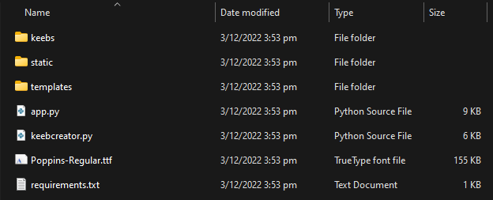

The `app.py` is usually the entry point of a Python Web Framework application, the `/static` folder stores the CSS and JS files, and the `/templates` folder stores the HTML files.
### Identifying the Flag
First step in tackling a whitebox web CTF challenge is to identify the location of the flag!
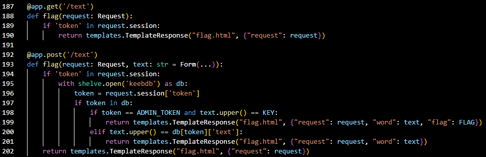

The `TemplateResponse` objects returned by the `/text` URI defined between lines 187 and 202 of `app.py` contains `flag.html`.
However, only line 199 passes the `FLAG` variable to the `flag.html` template. This is the way to obtain the flag!
### Flag Requirements
To obtain the flag, the following action needs to be performed:
1. Send a `HTTP POST` request to the `/text` URI
2. Provide a `POST` parameter named `text`
3. Provide a session object with a `token` key
4. Provided `token` value is equivalent to an arbitrary `ADMIN_TOKEN` variable
5. Provided `text` value is equivalent to an arbitrary `KEY` variable

The webpage at `/text` kindly provides a form field that satisfies requirement 1 and 2.

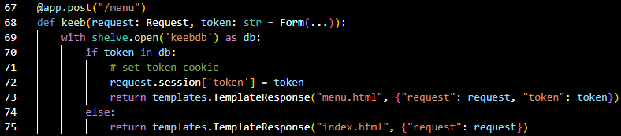

The `token` session key can be set by sending a `HTTP POST` request with a `token` variable to the `/menu` URI, satisfying requirement 3.

To figure out the value of `ADMIN_TOKEN`, look at how it is used.
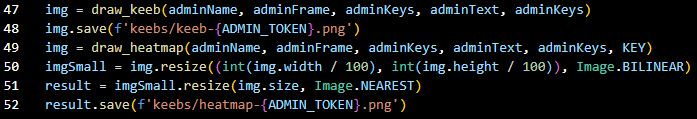
The `ADMIN_TOKEN` is the generated filename of the admin's keyboard and heatmap, as shown in line 48 and 52 of `app.py`.
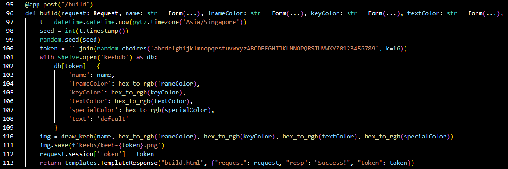

Looking at typical behaviour of the web application, it generates a 16 character long filename/token using a `random.choices` Pseudo Random Number Generator (PRNG) with the timestamp as the seed.
A PRNG will always generate the same sequence of numbers given the same seed. To crack the `ADMIN_TOKEN`, we just need the seed, which is the timestamp of when the admin created his/her keyboard. Conveniently for us, this information is provided in the challenge description! That is requirement 4 satisfied.

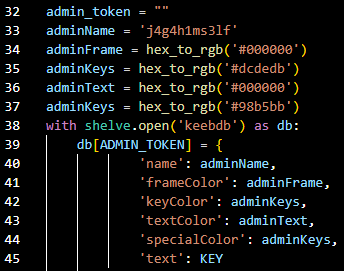

In line 45 of `app.py`, the `text` variable of the admin keyboard is set to the `KEY` variable that needs to be cracked.


The `KEY` variable is also passed into the `draw_heatmap` function as the sixth argument, as shown in line 49 of `app.py`. Line 9 of `app.py` states that the `draw_heatmap` function is imported from `keebcreator.py`.

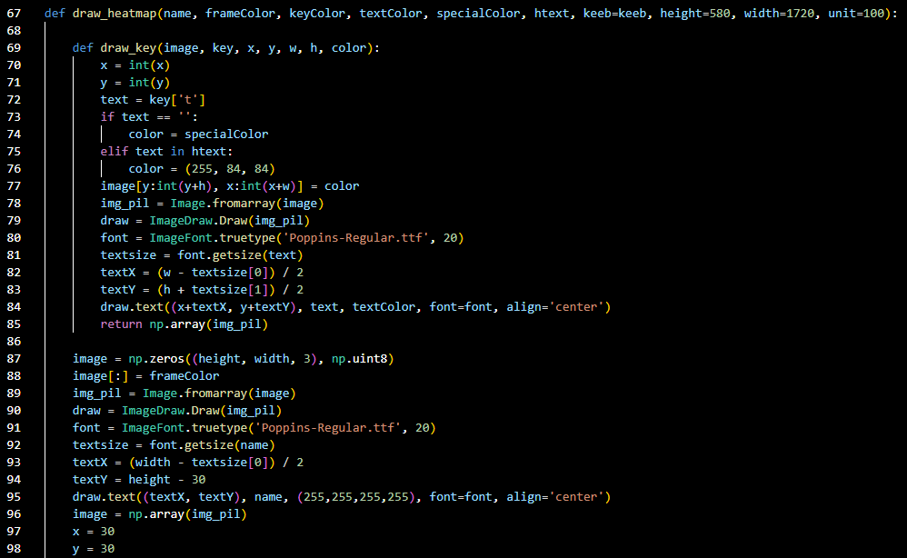

The `draw_heatmap` function first creates a `numpy` array based on the global `keeb` variable, which is just the US keyboard layout, as shown below.
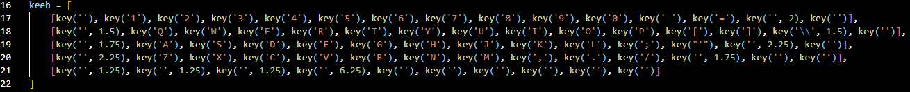

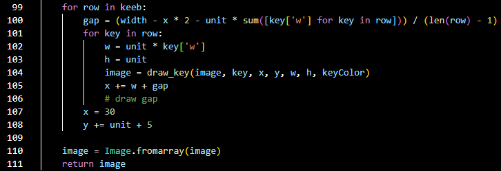

The `draw_heatmap` function then iterates through each row of `keeb`, passing in the created numpy array, `image`, the dimensions of the keyboard, and `keyColor` to the `draw_key` function.
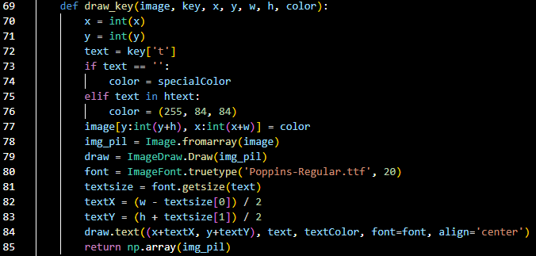

The `draw_key` function simply draws out the keyboard, setting the colour of the key to `RGB: 255,84,84`, which is a pastel shade of red, if the key is present in the `htext` variable. The `htext` variable is the sixth parameter of the `draw_heatmap` function, therefore all keys in `KEY` is coloured a pastel shade of red on the heatmap. Viewing the admin heatmap will provide the `KEY` value, satisfying the final requirement.
## Capture!
### Preparing Seed
The seed is generated with the following code:
```
t = datetime.datetime.now(pytz.timezone('Asia/Singapore'))
seed = int(t.timestamp())
random.seed(seed)
token = ''.join(random.choices('abcdefghijklmnopqrstuvwxyzABCDEFGHIJKLMNOPQRSTUVWXYZ0123456789', k=16))
```
Using a simple Python one-liner as shown below, it is verified that the seed is the EPOCH timestamp format.
```
import datetime;print(int(datetime.datetime.now().timestamp()))
1670297464
```
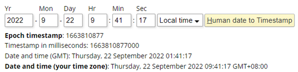

Using an [online epoch converter](https://www.epochconverter.com/), the datetime of the admin keyboard's creation converted to EPOCH is `1663810877`.
### (Re)Generating Admin Token (Requirement 4)
With the admin seed value obtained, the original code of the web application can be easily modified to use the admin seed value, as shown below.
```
import random
random.seed(1663810877)
token = ''.join(random.choices('abcdefghijklmnopqrstuvwxyzABCDEFGHIJKLMNOPQRSTUVWXYZ0123456789', k=16))
print(token)
```
The printed `token` is `rMwwbpMkzAwyRoWs`.
### Logging in as Admin (Requirement 3)
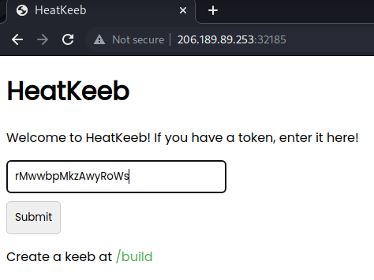

As mentioned previously, the web application's landing page provides a HTML form that stores the provided input in the `token` key of the session variable. Submit the cracked `ADMIN_TOKEN` here to login as admin.
### Viewing Admin HeatMap
After logging in as admin by submitting the form, the admin's heatmap can be viewed by clicking on the `View Latest Heatmap` button on the dashboard. The image below is the admin's heatmap.
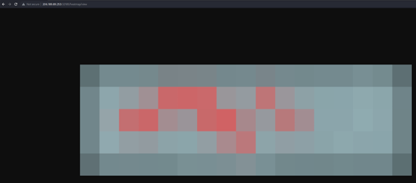


### Solving the HeatMap (Requirement 5)
There are two options to solve the heatmap image:
1. Reference each pixel of the heatmap image to the `keeb` array in `keebcreator.py`
2. Look down at your own keyboard and match the keys.

Method 2 is much more intuitive and simpler, and is the method I used. However, for the sake of completeness, method 1 is explained below as well.
#### Referencing `keeb` array
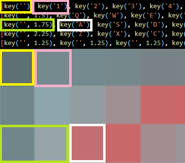

The `keeb` array contains 5 lists, `keeb[0]`, which is the first list in `keeb`, corresponds to the top line of pixels in the heatmap. `keeb[0][0]`, which is the first element of the first list in `keeb`, corresponds to the left-most pixel of the top line of the heatmap. This is colour coded as yellow in the image above.
However, `keeb[2][0]` is defined as `key('', 1.75)`, which specifies that it takes up 1.75 pixels horizontally, this is colour-coded as green in the image above.
This causes `keeb[2][1]` to be the third pixel in the third row, instead of being the second pixel of the third row, highlighted in white in the image above.
The above logic can be applied for every red pixel in the heatmap, showing that the `KEY` contains the following:
- keeb[1]
    - [3][4][5][8]
- keeb[2]
    - [1][2][5][6][9]
- keeb[3]
    - [6]

Which translates into `ertiasghln`. As the `[space]` key is not marked as red in the heatmap, it can be inferred that `KEY` is a 10-character long word in a certain permutation of `ertiasghln`. Time to play Scrabble!
Rearranging alphabets to form a word, like Scrabble, is known as an anagram. As my command of the English language is lacking, I relied on an [online anagram solver](https://www.thewordfinder.com/anagram-solver/).
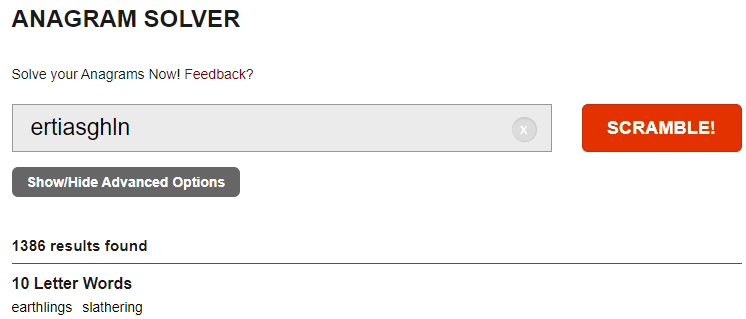

There are only two possible words:
* `earthlings`
* `slathering`

Given the alien theme of the CTF, it is probably the former.
### Capturing the Flag (Requirement 1, 2)
Access the `/text` URI by clicking on the `Test Your Text` button on the dashboard.
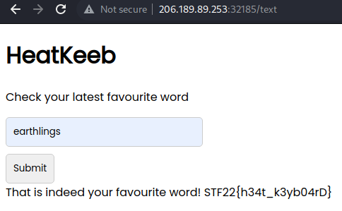

Submit the first key, `earthlings` to the form at `/text`. If the key is correct, the flag will be displayed! If not, try again with the second key, `slathering`.
## Flag
The final flag obtained is `STF22{h34t_k3yb04rD}`.
